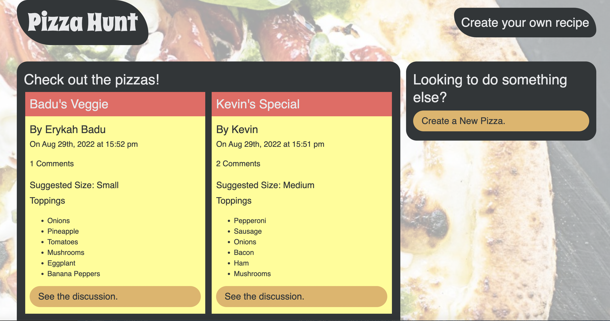
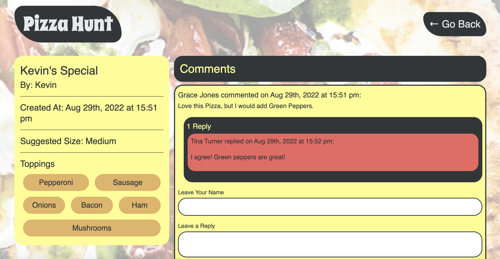

# Pizza Hunt

### User Story
As a user I want a website where I can share pizza recipes. As a user I would like all pizzqa recipies to be displayed when I load the page. When I click a recipe I should be able to see comments and replies to comments. As a user I want to be able to comment on other users' pizza recipies and reply to comments as well. 

### Features
This web app lets users share their pizxza recipes and comment on these recipes. It also allows users to reply to comments.
This web app features a MongoDB database and exprtess server.

### badges

## Table of Contents

- [installation](#installation)
- [contribution guidelines](#contribution)
- [Test Instructions](#testing)
- [License](#license)
- [Questions](#questions)

### Installation
Live application is at this link :
https://pizzahuntrecipes.herokuapp.com/

Or you can :
1. Clone the repo from : https://github.com/Vinyldude8896/Pizza-Hunt
2. make sure your MongoDB service is running (terminal command mongod)
3. install dependancies with npm install
3. use npm start to start the server
4. Navigate to localhost and load the page.
5. test clicking on current recipies and commenting or replying to comments.

### Contribution Guidelines
Kevin reid: https://github.com/Vinyldude8896

### Testing
1. Clone the repo from : https://github.com/Vinyldude8896/Pizza-Hunt
2. make sure your MongoDB service is running (terminal command mongod)
3. install dependancies with npm install
3. use npm start to start the server
4. Navigate to localhost and load the page.
5. test clicking on current recipies and commenting or replying to comments.

### Questions
    email address : kevinnivek@me.com
    - additional instructions 
    I can be contacted by phone as well, but prefer email contact first.

### Images of example readme.md

